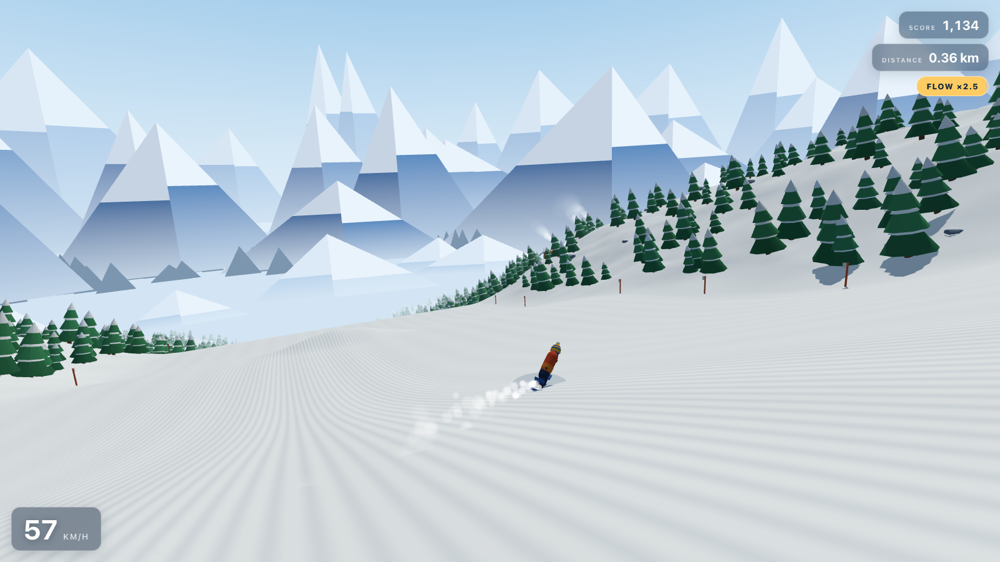

# Powder Line

An endless alpine snowboarding descent that runs in the browser. You carve a
groomed piste down a stylised valley — corduroy snow, snow-laden pines, a
smoking hamlet or two, and painted blue peaks all the way to the horizon.

This game was made using a single prompt:

> Make a game like https://x.com/alex_erm/status/2080739261909762364 in three.js



A 27-second gameplay clip is in [`docs/gameplay.mp4`](docs/gameplay.mp4)
(1280×720, 60 fps, H.264).

**Play it now:** <https://mag-.github.io/snowboarder/>

**Watch the gameplay:** [27-second demo video](docs/gameplay.mp4)

## Run it

```sh
npm start          # serves on http://localhost:8000
```

Then open <http://localhost:8000>. Three.js is vendored in `vendor/`, so the
game works offline.

A server is required during development (rather than opening `index.html`
directly) because the source is written as ES modules, which browsers refuse to
load over `file://`.

## Share it

```sh
npm run build
```

This bundles everything — game, Three.js, CSS, markup — into
`dist/powder-line.html`, a single ~575 KB file with no external requests. Open
it by double-clicking, email it, or drop it on any static host. It also emits
`dist/powder-line.fragment.html`, the same page without the `<html>`/`<head>`
wrapper, for hosts that supply their own document skeleton.

## Controls

| Action | Keyboard | Touch |
| --- | --- | --- |
| Carve | `A` / `D` or `←` / `→` | drag left / right |
| Ollie | `Space` | tap |
| Tuck (go faster) | `Shift` or `W` | — |
| Grab | `S` or `↓` | — |
| Pause | `P` or `Esc` | — |
| Restart | `R` | — |
| Hide HUD | `H` | — |
| Mute | `M` | — |
| Camera style | `C` | — |

## Scoring

- **Flow** builds while you hold a committed carve, raising the multiplier up to
  ×5. Crashing or straightening out loses it.
- **Air** pays for hang time, rotation and grabs. Spins only count as landed if
  you come down pointing roughly where you are travelling, so a 360 needs a real
  kicker under you — hold the carve direction through the whole flight.
- Your best run is kept in `localStorage`.

Kickers are part of the terrain rather than props, so hitting one at speed
launches you naturally; roll over the same lip slowly and nothing happens.

## How it works

| File | Role |
| --- | --- |
| `src/main.js` | Scene, lights, camera rig, game states, scoring |
| `src/terrain.js` | Height field, chunk recycling, corduroy snow shader |
| `src/scenery.js` | Instanced trees/rocks/cabins, painted mountain backdrop |
| `src/rider.js` | Snowboarder rig plus carving, air and landing physics |
| `src/particles.js` | Snow spray off the edge and chimney smoke |
| `src/input.js`, `src/hud.js`, `src/audio.js` | Controls, overlay UI, synthesised sound |
| `build.js` | Bundles the above into the single-file build |

A few things worth knowing if you want to change it:

- **Everything derives from one height function.** `terrainHeight(x, z)` in
  `src/terrain.js` defines the fall line, the meandering piste centre, the
  valley walls and the kickers. The mesh, the rider physics and the scenery
  placement all sample it, so they can never disagree.
- **The corduroy is a shader, not a texture.** `makeSnowMaterial()` injects
  ribs into `MeshLambertMaterial`, following the piste centreline and fading out
  analytically (via `fwidth`) once a rib is thinner than a pixel — which is what
  stops the distant snow from moiring.
- **Terrain streams in 64 m chunks.** Nine are alive at a time; each is rebuilt
  in place as it falls behind, and repopulates its own props deterministically
  from its chunk index, so the same stretch of mountain always looks the same.
- **Audio is synthesised at runtime.** Wind, edge hiss, landings and chimes are
  all Web Audio nodes, so there are no sound files to ship.
- **Steering is flipped once, at the input.** The chase camera looks down +Z, so
  world +X falls on the *left* of the frame. `Input.poll()` negates the steer
  value so `D` carves right on screen, and every downstream sign — yaw, body
  lean, spray side, camera offset — follows from that single flip.

Tunables worth playing with live in `src/config.js`: `PHYSICS` for speed and
handling, `SLOPE` for the shape of the valley, `CAMERA` for the chase rig
(`headingFollow` controls how much the camera leans into your carves).

## Requirements

Any current browser with WebGL2 — Chrome, Firefox, Safari or Edge.
